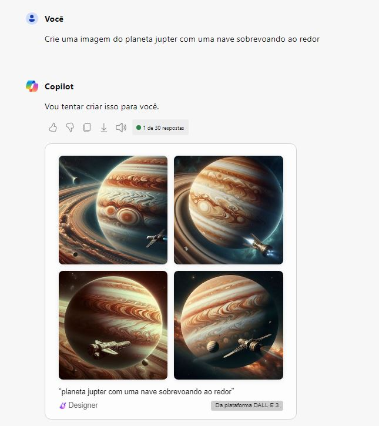

# Explorando os Recursos de IA Generativa com Copilot e OpenAI

## Laboratório 

### Microsoft copilot

    Durante o laboratório acessei o link [https://copilot.microsoft.com/](https://copilot.microsoft.com/) e entrei com os dados da minha conta do Azure. Já conectada com a minha conta, utilizei o serviço do prompt de geração de imagens e inseri a seguinte informação:

    **Crie uma imagem do planeta jupter com uma nave sobrevoando ao redor**

    Segue a resposta do copilot:

   

## Conclusão

O Microsoft Copilot, é um assistente de inteligência artificial projetado para ajudar com tarefas, responder a perguntas e criar conteúdo. Uma das importâncias na utilização desta IA é para nos ajudar em nossa produtividade.

**OBS: O recurso foi removido após a conclusão do laboratório**
